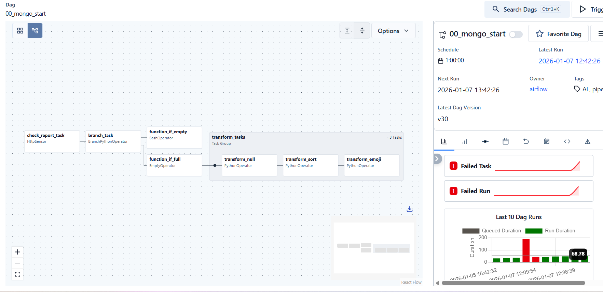
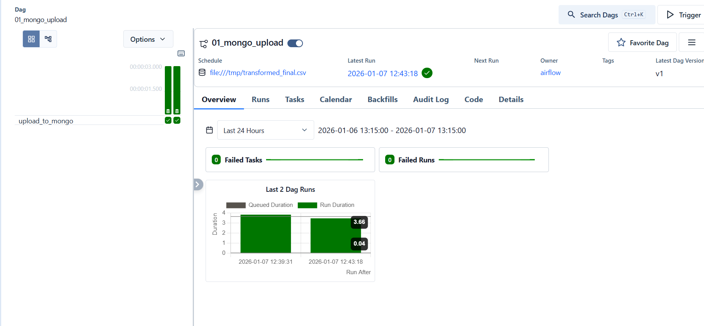

# Airflow → MongoDB Pipeline

This project implements a simple data pipeline using **Apache Airflow**, **Pandas**, and **MongoDB**.

---

## DAG: Upload Data from Folder

---

## DAG: Load Data to MongoDB

---

## DAGs Overview

### `00_mongo_start` – Data Processing

- Waits for a ZIP file via an HTTP Sensor  
- Checks if the file is empty using branching  
- Applies the following transformations:
  - Replace `null` values  
  - Sort data by `created_date`  
  - Remove emojis and unwanted characters  
- Publishes the processed file as a **Dataset**

---

### `01_mongo_upload` – Data Load

- Triggered by Dataset update  
- Loads processed data into MongoDB

---

## MongoDB Aggregations

After loading data into MongoDB, the following aggregation queries were executed:

- Top 5 frequently occurring comments  
- Entries with `content` shorter than 5 characters  
- Average rating per day (timestamp)
